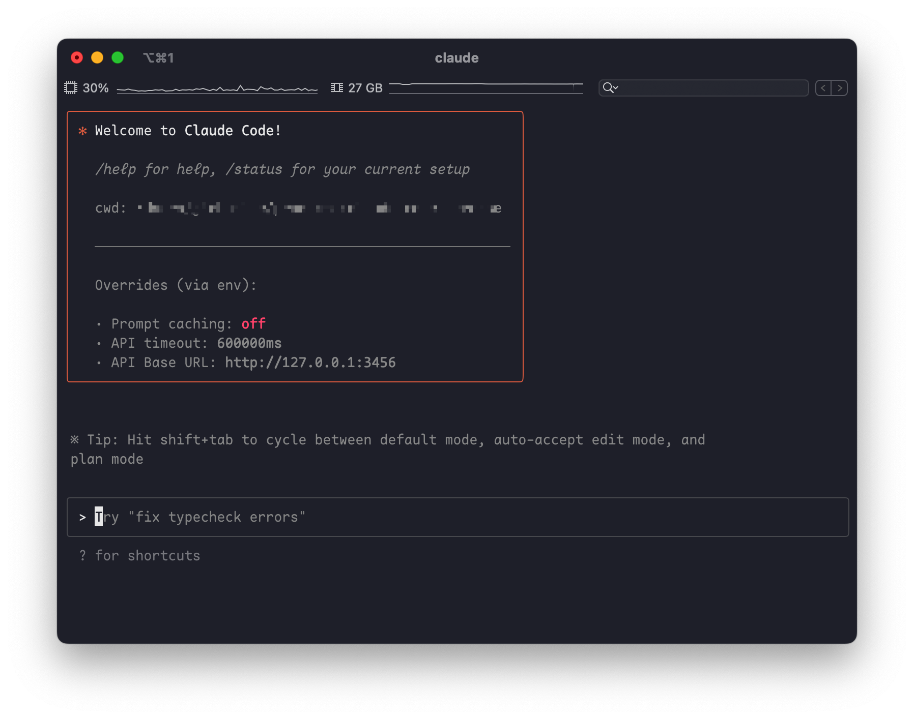

# Claude Code Router

> 一款强大的工具，可将 Claude Code 请求路由到不同的模型，并自定义任何请求。



## ✨ 功能

-   **模型路由**: 根据您的需求将请求路由到不同的模型（例如，后台任务、思考、长上下文）。
-   **多提供商支持**: 支持 OpenRouter、DeepSeek、Ollama、Gemini、Volcengine 和 SiliconFlow 等各种模型提供商。
-   **请求/响应转换**: 使用转换器为不同的提供商自定义请求和响应。
-   **动态模型切换**: 在 Claude Code 中使用 `/model` 命令动态切换模型。
-   **GitHub Actions 集成**: 在您的 GitHub 工作流程中触发 Claude Code 任务。
-   **插件系统**: 使用自定义转换器扩展功能。

## 🚀 快速入门

### 1. 安装

首先，请确保您已安装 [Claude Code](https://docs.anthropic.com/en/docs/claude-code/quickstart)：

```shell
npm install -g @anthropic-ai/claude-code
```

然后，安装 Claude Code Router：

```shell
npm install -g @arsasatria/ccw
```

### 2. 配置

创建并配置您的 `~/.ccw/config.json` 文件。有关更多详细信息，您可以参考 `config.example.json`。

`config.json` 文件有几个关键部分：
- **`PROXY_URL`** (可选): 您可以为 API 请求设置代理，例如：`"PROXY_URL": "http://127.0.0.1:7890"`。
- **`LOG`** (可选): 您可以通过将其设置为 `true` 来启用日志记录。日志文件将位于 `$HOME/.ccw.log`。
- **`APIKEY`** (可选): 您可以设置一个密钥来进行身份验证。设置后，客户端请求必须在 `Authorization` 请求头 (例如, `Bearer your-secret-key`) 或 `x-api-key` 请求头中提供此密钥。例如：`"APIKEY": "your-secret-key"`。
- **`HOST`** (可选): 您可以设置服务的主机地址。如果未设置 `APIKEY`，出于安全考虑，主机地址将强制设置为 `127.0.0.1`，以防止未经授权的访问。例如：`"HOST": "0.0.0.0"`。
- **`Providers`**: 用于配置不同的模型提供商。
- **`Router`**: 用于设置路由规则。`default` 指定默认模型，如果未配置其他路由，则该模型将用于所有请求。

这是一个综合示例：

```json
{
  "APIKEY": "your-secret-key",
  "PROXY_URL": "http://127.0.0.1:7890",
  "LOG": true,
  "Providers": [
    {
      "name": "openrouter",
      "api_base_url": "https://openrouter.ai/api/v1/chat/completions",
      "api_key": "sk-xxx",
      "models": [
        "google/gemini-2.5-pro-preview",
        "anthropic/claude-sonnet-4",
        "anthropic/claude-3.5-sonnet"
      ],
      "transformer": { "use": ["openrouter"] }
    },
    {
      "name": "deepseek",
      "api_base_url": "https://api.deepseek.com/chat/completions",
      "api_key": "sk-xxx",
      "models": ["deepseek-chat", "deepseek-reasoner"],
      "transformer": {
        "use": ["deepseek"],
        "deepseek-chat": { "use": ["tooluse"] }
      }
    },
    {
      "name": "ollama",
      "api_base_url": "http://localhost:11434/v1/chat/completions",
      "api_key": "ollama",
      "models": ["qwen2.5-coder:latest"]
    }
  ],
  "Router": {
    "default": "deepseek,deepseek-chat",
    "background": "ollama,qwen2.5-coder:latest",
    "think": "deepseek,deepseek-reasoner",
    "longContext": "openrouter,google/gemini-2.5-pro-preview"
  }
}
```


### 3. 使用 Router 运行 Claude Code

使用 router 启动 Claude Code：

```shell
ccr code
```

#### Providers

`Providers` 数组是您定义要使用的不同模型提供商的地方。每个提供商对象都需要：

-   `name`: 提供商的唯一名称。
-   `api_base_url`: 聊天补全的完整 API 端点。
-   `api_key`: 您提供商的 API 密钥。
-   `models`: 此提供商可用的模型名称列表。
-   `transformer` (可选): 指定用于处理请求和响应的转换器。

#### Transformers

Transformers 允许您修改请求和响应负载，以确保与不同提供商 API 的兼容性。

-   **全局 Transformer**: 将转换器应用于提供商的所有模型。在此示例中，`openrouter` 转换器将应用于 `openrouter` 提供商下的所有模型。
    ```json
     {
       "name": "openrouter",
       "api_base_url": "https://openrouter.ai/api/v1/chat/completions",
       "api_key": "sk-xxx",
       "models": [
         "google/gemini-2.5-pro-preview",
         "anthropic/claude-sonnet-4",
         "anthropic/claude-3.5-sonnet"
       ],
       "transformer": { "use": ["openrouter"] }
     }
    ```
-   **特定于模型的 Transformer**: 将转换器应用于特定模型。在此示例中，`deepseek` 转换器应用于所有模型，而额外的 `tooluse` 转换器仅应用于 `deepseek-chat` 模型。
    ```json
     {
       "name": "deepseek",
       "api_base_url": "https://api.deepseek.com/chat/completions",
       "api_key": "sk-xxx",
       "models": ["deepseek-chat", "deepseek-reasoner"],
       "transformer": {
         "use": ["deepseek"],
         "deepseek-chat": { "use": ["tooluse"] }
       }
     }
    ```

-   **向 Transformer 传递选项**: 某些转换器（如 `maxtoken`）接受选项。要传递选项，请使用嵌套数组，其中第一个元素是转换器名称，第二个元素是选项对象。
    ```json
    {
      "name": "siliconflow",
      "api_base_url": "https://api.siliconflow.cn/v1/chat/completions",
      "api_key": "sk-xxx",
      "models": ["moonshotai/Kimi-K2-Instruct"],
      "transformer": {
        "use": [
          [
            "maxtoken",
            {
              "max_tokens": 16384
            }
          ]
        ]
      }
    }
    ```

**可用的内置 Transformer：**

-   `deepseek`: 适配 DeepSeek API 的请求/响应。
-   `gemini`: 适配 Gemini API 的请求/响应。
-   `openrouter`: 适配 OpenRouter API 的请求/响应。
-   `groq`: 适配 groq API 的请求/响应
-   `maxtoken`: 设置特定的 `max_tokens` 值。
-   `tooluse`: 优化某些模型的工具使用(通过`tool_choice`参数)。
-   `gemini-cli` (实验性): 通过 Gemini CLI [gemini-cli.js](https://gist.github.com/musistudio/1c13a65f35916a7ab690649d3df8d1cd) 对 Gemini 的非官方支持。

**自定义 Transformer:**

您还可以创建自己的转换器，并通过 `config.json` 中的 `transformers` 字段加载它们。

```json
{
  "transformers": [
      {
        "path": "$HOME/.ccw/plugins/gemini-cli.js",
        "options": {
          "project": "xxx"
        }
      }
  ]
}
```

#### Router

`Router` 对象定义了在不同场景下使用哪个模型：

-   `default`: 用于常规任务的默认模型。
-   `background`: 用于后台任务的模型。这可以是一个较小的本地模型以节省成本。
-   `think`: 用于推理密集型任务（如计划模式）的模型。
-   `longContext`: 用于处理长上下文（例如，> 60K 令牌）的模型。

您还可以使用 `/model` 命令在 Claude Code 中动态切换模型：
`/model provider_name,model_name`
示例: `/model openrouter,anthropic/claude-3.5-sonnet`


## 🤖 GitHub Actions

将 Claude Code Router 集成到您的 CI/CD 管道中。在设置 [Claude Code Actions](https://docs.anthropic.com/en/docs/claude-code/github-actions) 后，修改您的 `.github/workflows/claude.yaml` 以使用路由器：

```yaml
name: Claude Code

on:
  issue_comment:
    types: [created]
  # ... other triggers

jobs:
  claude:
    if: |
      (github.event_name == 'issue_comment' && contains(github.event.comment.body, '@claude')) ||
      # ... other conditions
    runs-on: ubuntu-latest
    permissions:
      contents: read
      pull-requests: read
      issues: read
      id-token: write
    steps:
      - name: Checkout repository
        uses: actions/checkout@v4
        with:
          fetch-depth: 1

      - name: Prepare Environment
        run: |
          curl -fsSL https://bun.sh/install | bash
          mkdir -p $HOME/.ccw
          cat << 'EOF' > $HOME/.ccw/config.json
          {
            "log": true,
            "OPENAI_API_KEY": "${{ secrets.OPENAI_API_KEY }}",
            "OPENAI_BASE_URL": "https://api.deepseek.com",
            "OPENAI_MODEL": "deepseek-chat"
          }
          EOF
        shell: bash

      - name: Start Claude Code Router
        run: |
          nohup ~/.bun/bin/bunx @arsasatria/ccw@1.0.8 start &
        shell: bash

      - name: Run Claude Code
        id: claude
        uses: anthropics/claude-code-action@beta
        env:
          ANTHROPIC_BASE_URL: http://localhost:3456
        with:
          anthropic_api_key: "any-string-is-ok"
```

这种设置可以实现有趣的自动化，例如在非高峰时段运行任务以降低 API 成本。

## 📝 深入阅读

-   [项目动机和工作原理](blog/zh/项目初衷及原理.md)
-   [也许我们可以用路由器做更多事情](blog/zh/或许我们能在Router中做更多事情.md)

## ❤️ 支持与赞助

如果您觉得这个项目有帮助，请考虑赞助它的开发。非常感谢您的支持！

[](https://ko-fi.com/F1F31GN2GM)

<table>
  <tr>
    <td></td>
    <td></td>
  </tr>
</table>

### 我们的赞助商

非常感谢所有赞助商的慷慨支持！

- @Simon Leischnig
- [@duanshuaimin](https://github.com/duanshuaimin)
- [@vrgitadmin](https://github.com/vrgitadmin)
- @*o
- [@ceilwoo](https://github.com/ceilwoo)
- @*说
- @*更
- @K*g
- @R*R
- [@bobleer](https://github.com/bobleer)
- @*苗
- @*划
- [@Clarence-pan](https://github.com/Clarence-pan)
- [@carter003](https://github.com/carter003)
- @S*r
- @*晖
- @*敏
- @Z*z
- @*然
- [@cluic](https://github.com/cluic)
- @*苗
- [@PromptExpert](https://github.com/PromptExpert)
- @*应
- [@yusnake](https://github.com/yusnake)
- @*飞
- @董*
- *汀
- *涯
- *:-）

（如果您的名字被屏蔽，请通过我的主页电子邮件与我联系，以便使用您的 GitHub 用户名进行更新。）


## 交流群
